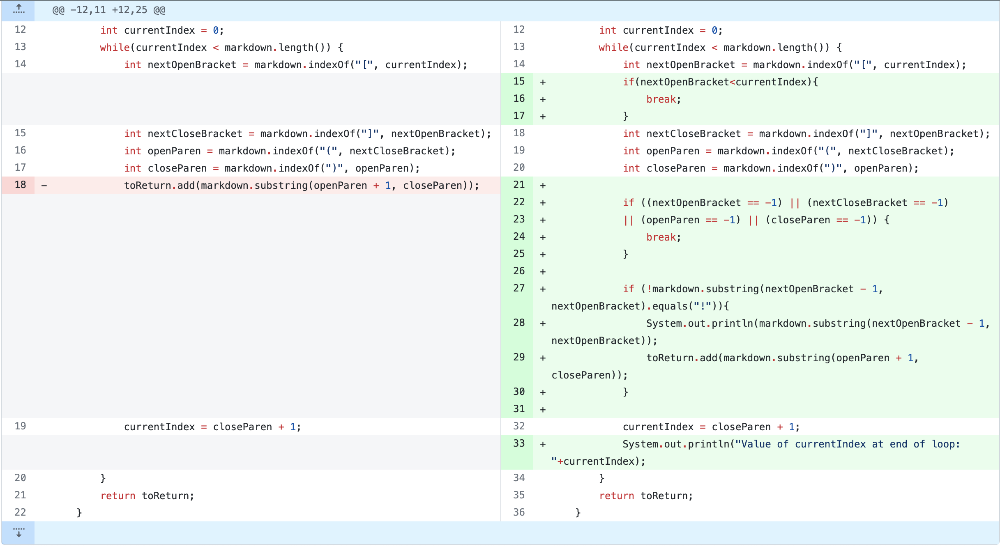
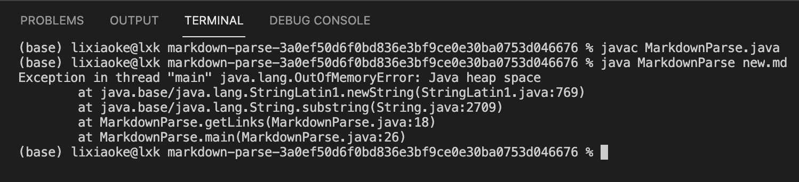
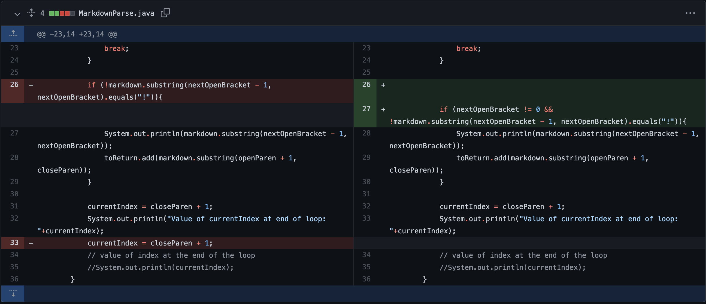
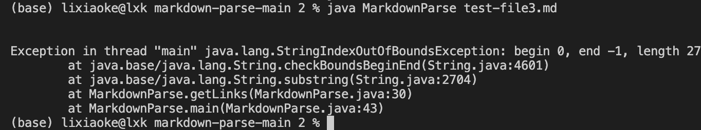
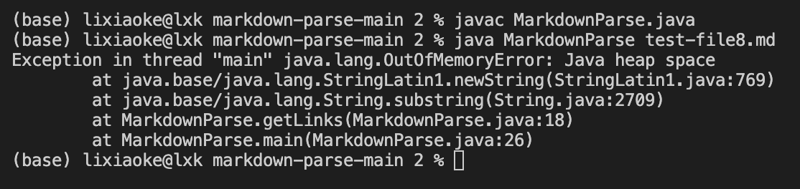

# CSE 15L Lab Report2
## **Bug Fixing #1**

The code is below.

The link of corresponding input is here.

>https://github.com/LXKeee/markdown-parse/blob/main/new.md

The symptom of that failure-inducing input is here.

The bug is triggered because there are characters after the ) of the last link, so after having added two links into our **toReturn** (just like what it does when running on our original **test-file.md**), the **currentIndex** is still smaller than **markdown.length()**, which makes the while loop continue searching for [ ] and ( ).

However, there is no more [ ] or ( ), which means there is no way to increase the **currentIndex**, make it larger than **markdown.length()** and break this loop. So the program will keep running without a stop.

To solve it, we add some codes so that when the index of **nextOpenBracket** is -1, we can break this loop.

## **Bug Fixing #2**

The code is below.

The link of corresponding input is here.

>https://github.com/littlefishy1/markdown-parse/blob/690b05b4893db2ac709dca210f81ba505b4d1a96/test-file3.md

The symptom of that failure-inducing input is here.

This bug is because in the **test-file3.md**, there are [ ] but there are no ( ). Therefore the index of **openParen** and **closeParen** are both -1. So, when we ask the program to do **markdown.substring(openParen + 1, closeParen)**, it will become substring(0,-1), which cause java.lang.StringIndexOutOfBoundsException.

## **Bug Fixing #3**

The code is below. (the same as the Bug Fixing #2)

The link of corresponding input is here.

>https://github.com/littlefishy1/markdown-parse/blob/690b05b4893db2ac709dca210f81ba505b4d1a96/test-file8.md

The symptom of that failure-inducing input is here.

This bug is similar to the bug #1, which also causes java.lang.OutOfMemoryError. This bug is caused by we did not include a if-statement that can break the loop when there is no one or some of [ ] ( ).
