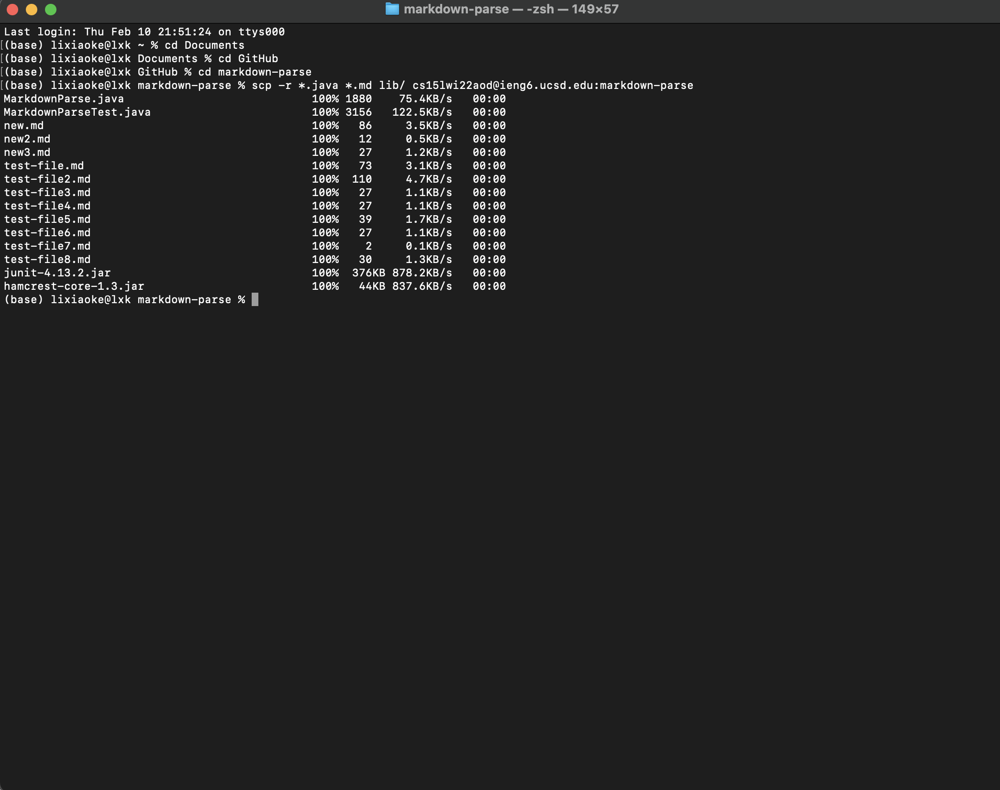

# CSE 15L Lab Report3
## **Copy whole directories with scp -r**

1. Show copying your whole markdown-parse directory to your ieng6 account

> First, I use **cd** to go into my markdownParse folder. I use **scp -r *.java *.md lib/ cs15lwi22aod@ieng6.ucsd.edu:markdown-parse** to create a new folder called **markdown-parse** in my remote server, and recursively copy all the files of .java and .md type, and the lib folder in my original markdownParse folder into that folder. 

2. Show logging into your ieng6 account after doing this and compiling and running the tests for your repository

> I log in by using **ssh**. Then, I use **javac -cp .:lib/junit-4.13.2.jar:lib/hamcrest-core-1.3.jar MarkdownParseTest.java** to compile my MarkdownParseTest.java. After that, I use **java -cp .:lib/junit-4.13.2.jar:lib/hamcrest-core-1.3.jar org.junit.runner.JUnitCore MarkdownParseTest** to run my tests.

3. Show (like in the last step of the first lab) combining scp, ;, and ssh to copy the whole directory and run the tests in one line.

> Here I met a problem. I use **scp -r *.java *.md lib/ cs15lwi22aod@ieng6.ucsd.edu:markdown-parse; ssh cs15lwi22aod@ieng6.ucsd.edu "cd markdown-parse; /software/CSE/oracle-java-se-14/jdk-14.0.2/bin/javac MarkdownParseTest.java; /software/CSE/oracle-java-se-14/jdk-14.0.2/bin/java MarkdownParseTest"** but the output shows there is no main method in my test file. I am trying to fix this.
