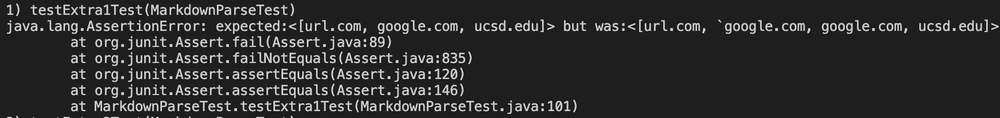
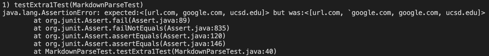
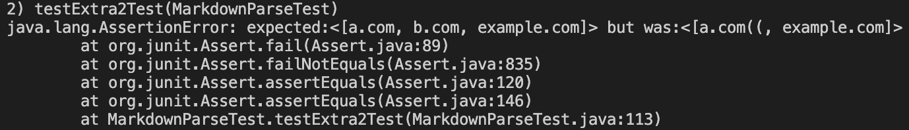
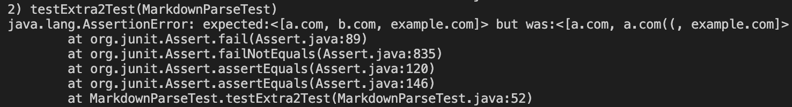
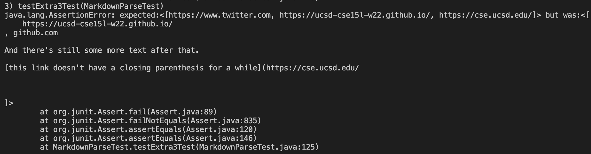
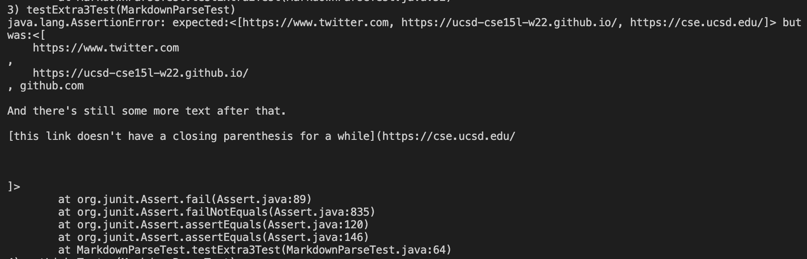

# CSE 15L Lab Report3

> Link to my markdown-parse repository: https://github.com/LXKeee/markdown-parse.git

>Link to my review markdown-parse repository: https://github.com/jnhuang02/markdown-parse/blob/main/MarkdownParse.java

## **Snippet 1 in my markdown-parse**
**Codes of test:**
```
@Test
    public void testExtra1Test() throws IOException{
        Path fileName = Path.of("extra1.md");
        String contents = Files.readString(fileName);
        ArrayList <String> links = MarkdownParse.getLinks(contents);
        ArrayList <String> list = new ArrayList<String>();
        list.add("url.com");
        list.add("google.com");
        list.add("ucsd.edu");
        assertEquals(list, links);
    }
```
**Output:**

[url.com, `google.com, google.com, ucsd.edu]

It does not pass this test.



## **Snippet 1 in review markdown-parse**
**Codes of test:**
```
@Test
    public void testExtra1Test() throws IOException{
        Path fileName = Path.of("extra1.md");
        String contents = Files.readString(fileName);
        ArrayList <String> links = MarkdownParse.getLinks(contents);
        ArrayList <String> list = new ArrayList<String>();
        list.add("url.com");
        list.add("google.com");
        list.add("ucsd.edu");
        assertEquals(list, links);
    }
```
**Output:**

[url.com, `google.com, google.com, ucsd.edu]

It does not pass this test.



## **Snippet 2 in my markdown-parse**
**Codes of test:**
```
@Test
    public void testExtra2Test() throws IOException{
        Path fileName = Path.of("extra2.md");
        String contents = Files.readString(fileName);
        ArrayList <String> links = MarkdownParse.getLinks(contents);
        ArrayList <String> list = new ArrayList<String>();
        list.add("a.com");
        list.add("b.com");
        list.add("example.com");
        assertEquals(list, links);
    }
```
**Output:**

[a.com((, example.com]

It does not pass the test.


## **Snippet 2 in review markdown-parse**
**Codes of test:**
```
@Test
    public void testExtra2Test() throws IOException{
        Path fileName = Path.of("extra2.md");
        String contents = Files.readString(fileName);
        ArrayList <String> links = MarkdownParse.getLinks(contents);
        ArrayList <String> list = new ArrayList<String>();
        list.add("a.com");
        list.add("b.com");
        list.add("example.com");
        assertEquals(list, links);
    }
```
**Output:**

[a.com, a.com((, example.com]

It does not pass the test.




## **Snippet 3 in my markdown-parse**
**Codes of test:**
```
@Test
    public void testExtra3Test() throws IOException{
        Path fileName = Path.of("extra3.md");
        String contents = Files.readString(fileName);
        ArrayList <String> links = MarkdownParse.getLinks(contents);
        ArrayList <String> list = new ArrayList<String>();
        list.add("https://www.twitter.com");
        list.add("https://ucsd-cse15l-w22.github.io/");
        list.add("https://cse.ucsd.edu/");
        assertEquals(list, links);
    }
```
**Output:**

[
    https://ucsd-cse15l-w22.github.io/
, github.com

And there's still some more text after that.

[this link doesn't have a closing parenthesis for a while](https://cse.ucsd.edu/


]

It does not pass the test.


## **Snippet 3 in review markdown-parse**
**Codes of test:**
```
@Test
    public void testExtra3Test() throws IOException{
        Path fileName = Path.of("extra3.md");
        String contents = Files.readString(fileName);
        ArrayList <String> links = MarkdownParse.getLinks(contents);
        ArrayList <String> list = new ArrayList<String>();
        list.add("https://www.twitter.com");
        list.add("https://ucsd-cse15l-w22.github.io/");
        list.add("https://cse.ucsd.edu/");
        assertEquals(list, links);
    }
```
**Output:**

[
    https://www.twitter.com
, 
    https://ucsd-cse15l-w22.github.io/
, github.com

And there's still some more text after that.

[this link doesn't have a closing parenthesis for a while](https://cse.ucsd.edu/


]

It does not pass the test.


## **Question 1**
I think we can define the **markdown.substring(openParen + 1, closeParen)** as a new variable, use a for-loop to check is there backtick in it. If there is, use **.replace("`","")** to remove the backtick inside it. After that, we can use a for-loop to check is there a same link in **toReturn**.

## **Question 2**
We can add some if-statements that check whether there is a close parenthese or bracket followed by open parenthese or bracket. If there is not what we are expecting, we can go into next loop.

## **Question 3**
Maybe we can use if-statement to check is there any /n in the strings between **nextOpenBracket** and **nextCloseBracket**, or **openParen** and **closeParen**. If there is, we can use **.replace**. Then we can do what we originally want to do.
