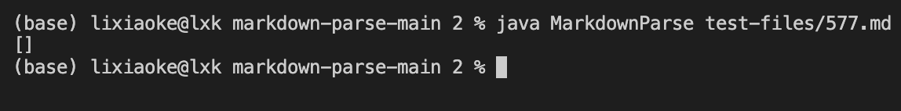
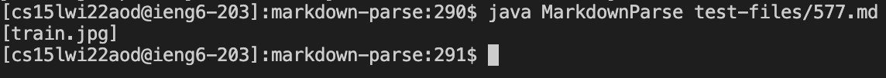
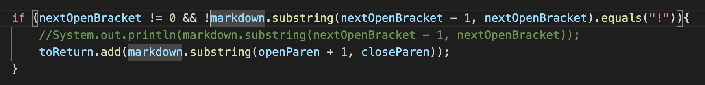
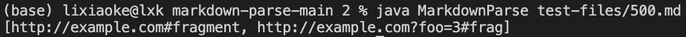
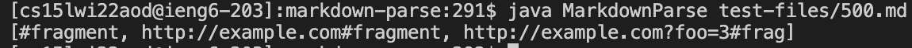

# CSE 15L Lab Report5

> Link to my markdown-parse repository: https://github.com/LXKeee/markdown-parse.git

>Link to the markdown-parse repository provided by week9: https://github.com/ucsd-cse15l-w22/markdown-parse.git

## **First Test - test-files/577.md**
1. How do I find different result?

I add a command of **echo $file** into my script.sh, then find the two different results by running **bash script.sh** in terminal.

2. Describe which implementation is correct, or if you think neither is correct, by showing both actual outputs and indicating what the expected output is.

The output of my **MarkdownParse.java** is []

The output of the another is [train.jpg]

Since the link in original test file has both [] and () around itself, I think the output of [train.jpg] is correct.

3. For the implementation that’s not correct (or choose one if both are incorrect), describe the _bug (the problem in the code). Be specific about what is wrong with the program, and show the code that should be fixed.

The problem is that, in line40, one of the conditions for adding link to **toReturn** is **!markdown.substring(nextOpenBracket - 1, nextOpenBracket).equals("!")**. Therefore, since the content of test file is started with **!**, the link will not be added to **toReturn**.

## **Second Test - test-files/500.md**
1. How do I find different result?

This time, I first run these test files from my own **MarkdownParse.java** and record the results into a file called **myResults.txt**.

Then, I clone my repository including this file onto the **ssh**. Here I already have a **result.txt**, which is the result of running test files with professor's **MarkdownParse.java**. I compared these two txt files by using **diff** command.

2. Describe which implementation is correct, or if you think neither is correct, by showing both actual outputs and indicating what the expected output is.

The output of my **MarkdownParse.java** is [http://example.com#fragment, http://example.com?foo=3#frag]

The output of the another is [#fragment, http://example.com#fragment, http://example.com?foo=3#frag]

I think the output of [#fragment, http://example.com#fragment, http://example.com?foo=3#frag] is correct, which is the implementation of the markdown-parse provided by week9 page.

3. For the implementation that’s not correct (or choose one if both are incorrect), describe the _bug (the problem in the code). Be specific about what is wrong with the program, and show the code that should be fixed.

The problem is also one of the condition from line40, which is the restricting that the index open bracket should not be 0. However, in this test file, the open bracket of the first line is in index 0. Therefore, it will not be included in the result ArrayList.

