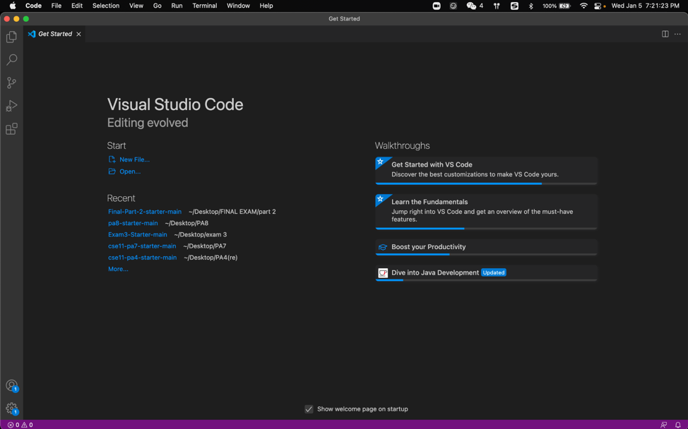

# CSE 15L Lab Report1
## Content
1. Installing VScode
2. Remotely Connecting
3. Trying Some Commands
4. Moving Files with scp
5. Setting an SSH Key
6. Optimizing Remote Running

---

## **Installing VScode**

First, go to the website of VS Code(https://code.visualstudio.com/), and download the version which is corresponding to the system of laptop. Then install it.

After that, open the VS Code.

We can also change the appearance.

---

## **Remotely Connecting**

After installing the VS Code, we can remotely connect to the computers on campus.

First, look up your account by using [link](https://sdacs.ucsd.edu/~icc/index.php).

Then, type ssh + your account + @ieng6.ucsd.edu. Just like this one.

>Here, it automatically log in because during the lab 1, we saved our keys into the server. Usually it will require us to type in the password.

---

## **Trying Some Commands**

- **cd** and **cd~**
>The command **cd** will change the directory to home directory. The command **cd~** will change the directory to what is typed afterward. If there is nothing, then it will direct to home directory.

-**ls -lat** and **ls -a**
>Both of them will show the contents. *PS the contents with a dot in the front mean they are hidden*

-**cp /home/linux/ieng6/cs15lwi22/public/hello.txt ~/**
-**cat /home/linux/ieng6/cs15lwi22/public/hello.txt**
>**cp** means copy, and **cat** means print the content. But here we don't have the access right now, so the access is denied.

-**exit**
>To log out, we can use **exit** or **Ctrl+D**.

---

## **Moving Files with scp**

After creating the **WhereAmI.java** in our computer, we use **scp** command to copy it to the remote server, which is the computer on campus.

So, after logging into the server, use **ls** and we can see the **WhereAmI.java**.

---

## **Setting an SSH Key**

By typing **ssh-keygen**, we can set up our key.

>Here it asks to overwrite or not, because during the lab I have set up the key.

---

## **Optimizing Remote Running**

We can have multiple commands at the same line by writing commands in quote.

